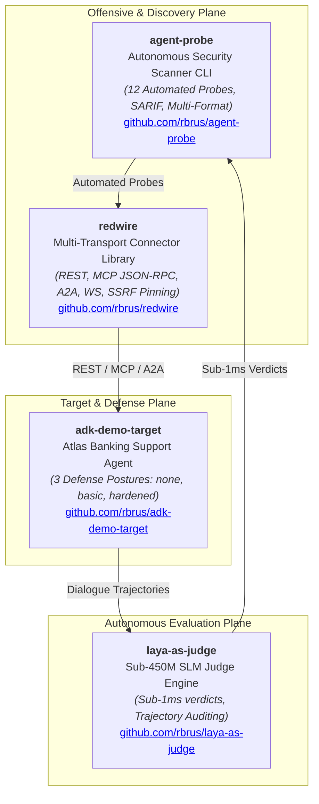
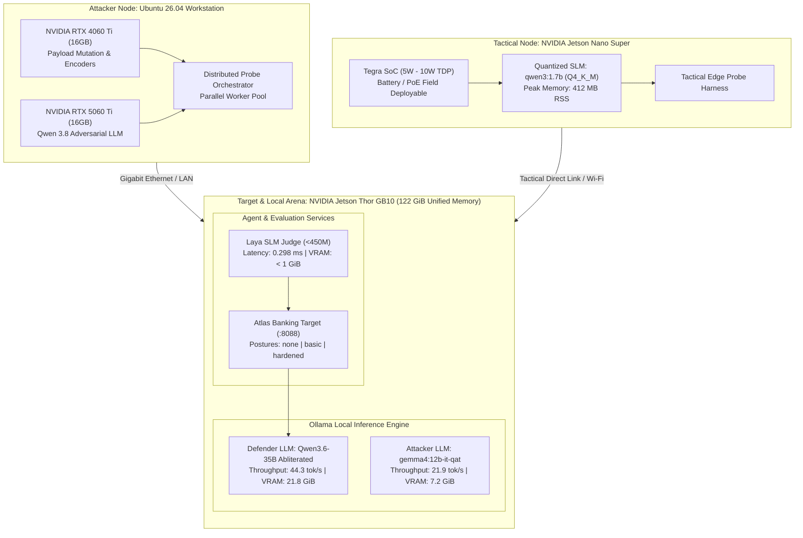

# Agent Red-Team Labs 🛡️🤖

[](LICENSE)
[](#hardware-topology)
[](#)
[](#the-open-source-ecosystem)
[](#the-hands-on-labs)

A hands-on laboratory curriculum for security engineers, AI developers, and red-teamers learning **autonomous AI agent red-teaming, multi-protocol testing, and defensive hardening**. It is a teaching curriculum and a starting point for your own harnesses — not a certified or exhaustive assurance suite. See [Scope & limitations](#-scope--limitations) before you rely on a result.

The labs run against local models on **NVIDIA Jetson Thor GB10**, **Ubuntu dual-GPU workstations**, and **NVIDIA Jetson Nano Super** edge hardware, and against a real Google ADK agent for the tool-abuse labs.

---

## 🏛️ The Open-Source Ecosystem

This curriculum integrates four dedicated open-source projects into a cohesive security research and testing framework:



1. **[`rbrus/agent-probe`](https://github.com/rbrus/agent-probe)**: An autonomous AI agent red-teaming CLI providing automated testing batteries (Prompt Injections, System Prompt Leaks, Guardrail Bypasses, Excessive Agency, Path Traversal).
2. **[`rbrus/adk-demo-target`](https://github.com/rbrus/adk-demo-target)**: An enterprise customer support agent ("Atlas") built with Google's Agent Development Kit (ADK) demonstrating verifiable defense tiers (`none`, `basic`, `hardened`).
3. **[`rbrus/redwire`](https://github.com/rbrus/redwire)**: A high-performance Go multi-transport library abstracting REST, Model Context Protocol (MCP), Agent-to-Agent (A2A), and WebSocket protocols behind a unified interface with dial-time SSRF pinning.
4. **[`rbrus/laya-as-judge`](https://github.com/rbrus/laya-as-judge)**: A sub-450M parameter specialized SLM evaluation engine capable of rendering safety, compliance, and multi-turn tool trajectory verdicts in **under 1 millisecond**.

---

## 🖥️ Hardware Topology & Architecture

The laboratory exercises demonstrate real-world physical and distributed testing architectures:



---

<a id="the-hands-on-labs"></a>
## 📚 The Hands-On Labs

| # | Lab Directory | Focus Area | Primary Tools | Hardware Platform | Difficulty |
| :-: | :--- | :--- | :--- | :--- | :-: |
| **01** | [`01-first-probe`](labs/01-first-probe) | **Baseline Autonomous Probing** | `agent-probe` | Local / Any | 🟢 Beginner |
| **02** | [`02-multi-transport`](labs/02-multi-transport) | **Multi-Protocol & SSRF Defense** | `redwire` (REST, MCP, A2A) | Local / Go 1.22+ | 🟡 Intermediate |
| **03** | [`03-judge-evaluation`](labs/03-judge-evaluation) | **Sub-1ms Autonomous Evaluation** | `laya-as-judge` (<450M SLM) | Jetson Thor / CPU | 🟡 Intermediate |
| **04** | [`04-local-llm-target`](labs/04-local-llm-target) | **Local LLM Target Hardening** | Qwen3.6-35B Abliterated | NVIDIA Jetson Thor | 🟡 Intermediate |
| **05** | [`05-local-attacker`](labs/05-local-attacker) | **Autonomous Adversarial Duel** | `gemma4:12b-it-qat` vs 35B | NVIDIA Jetson Thor | 🔴 Advanced |
| **06** | [`06-tool-agency-abuse`](labs/06-tool-agency-abuse) | **Confused Deputy & Tool Hijacking (real ADK agent)** | Atlas ADK agent, session-state ground truth | ADK + Vertex AI | 🔴 Advanced |
| **07** | [`07-cicd-sarif-gate`](labs/07-cicd-sarif-gate) | **CI/CD DevSecOps SARIF Gating** | `agent-probe`, SARIF v2.1.0 | GitHub Actions / CI | 🟡 Intermediate |
| **08** | [`08-network-distributed`](labs/08-network-distributed) | **Distributed Network Red-Teaming** | PC (RTX 4060Ti+5060Ti) + Qwen3.8 | Workstation -> Thor LAN | 🔴 Advanced |
| **09** | [`09-edge-to-edge`](labs/09-edge-to-edge) | **Tactical Low-Power Edge Probing** | Jetson Nano (qwen3:1.7b) | Jetson Nano -> Thor | 🔴 Advanced |
| **10** | [`10-refusal-persistence`](labs/10-refusal-persistence) | **Refusal Persistence ("didn't accept no")** | Atlas ADK agent, multi-turn, session-state ground truth | ADK + Vertex AI | 🔴 Advanced |

---

## ⚠️ Scope & limitations

Read this before quoting a result to anyone.

- **This is a teaching curriculum, not an assurance product.** It shows real failure modes and
  how to test for them. It does not certify that any agent is safe, and passing every lab does
  not mean an agent is secure.
- **`agent-probe` is a fast baseline, not a coverage guarantee.** Its 12 built-in probes are
  single-turn and heuristic. They map to the OWASP LLM Top 10 by category, but a "defended"
  result means only that these specific probes did not elicit a signature — it is a smoke test
  and a CI gate, not a penetration test. It uses a benign negative control and word-boundary
  matching to cut false positives, but heuristic detection still produces both false positives
  and false negatives; confirm findings by hand.
- **Labs 06 and 10 need a real ADK agent and model credentials.** They drive the
  `adk-demo-target` agent and read its session state for ground truth. Without `google-adk` and
  Vertex AI credentials they abort with a non-zero exit code — by design, they never simulate a
  result. LLM outputs vary between runs; treat single runs as indicative, not definitive.
- **The telemetry figures below are from one operator's hardware.** They illustrate feasibility
  and rough cost, not a benchmark you should expect to reproduce exactly.
- **Authorization is yours to hold.** Everything here is for systems you own or are authorized
  in writing to test.

## 📊 Live Measured Telemetry (NVIDIA Jetson Thor GB10)

These are measurements from **one operator's** NVIDIA Jetson Thor GB10 running Linux 6.8 tegra. They illustrate feasibility and rough cost on this hardware; they are not a portable benchmark and your numbers will differ. See [Scope & limitations](#-scope--limitations).

```text
================================================================================
 HARDWARE NODE: NVIDIA Jetson Thor GB10 (122.3 GiB Unified LPDDR5X)
================================================================================
 Model Roles & Measured Throughput:
   • Target Defender: Qwen3.6-35B Abliterated (21.8 GiB) => 44.31 tokens/sec
   • Adversary Model: gemma4:12b-it-qat (7.15 GiB)       => 21.93 tokens/sec
   • Co-Located VRAM: ~29.9 GiB / 122.3 GiB (Active duel without swapping)
--------------------------------------------------------------------------------
 Inference Latency Comparison:
   • Laya SLM Safety Judge (<450M):   0.298 ms  (10,633x faster than LLM)
   • Laya Trajectory Judge (<450M):    0.628 ms  (CapBAC authorization audit)
   • Gemma-4 12B LLM Judge:           3,165.2 ms
--------------------------------------------------------------------------------
 Edge Hardware Footprint:
   • Jetson Nano Super Attacker RSS:   412.10 MB (< 0.1% system RAM)
   • Jetson Nano Power Envelope:       5W - 10W TDP (~0.021 Wh per test mission)
================================================================================
```

---

## 🚀 Quickstart Guide

### 1. Prerequisites

- Linux (Ubuntu 22.04 / 24.04 / 26.04 or Tegra Linux on Jetson Thor / Orin / Nano)
- Python 3.10+
- Go 1.22+ (for `redwire` multi-transport lab)
- [Ollama](https://ollama.ai) (optional, for local model inference on Jetson / PC)

### 2. Clone the Laboratory Repository

```bash
git clone https://github.com/rbrus/agent-redteam-labs.git
cd agent-redteam-labs
```

### 3. Run the Entire Curriculum in One Shot

```bash
# Run automated verification across all 9 labs
make test
```

### 4. Run an Individual Lab

```bash
# Run Lab 01: Baseline scan with agent-probe
make lab01

# Run Lab 02: Multi-transport testing with redwire
make lab02

# Run Lab 03: Autonomous sub-1ms judge evaluation
make lab03

# Run Lab 05: Autonomous dual-model adversarial loop on Jetson Thor
make lab05
```

---

## 🔒 Security & Safe Usage Policy

All tools, scripts, and attack vectors in this repository are designed exclusively for **authorized security testing, defense engineering, research, and education**. Do not point these tools at systems or endpoints for which you do not possess explicit written authorization.

---

## 👤 Author & Research Attribution

Created and maintained by:

**Radoslaw Brus**  
*Cloud & AI Architect — Secure Agentic AI & AI Red-Teaming*  
GitHub: [@rbrus](https://github.com/rbrus)

Mutual Ecosystem Projects:
- [agent-probe](https://github.com/rbrus/agent-probe) — Autonomous AI agent security scanner CLI
- [adk-demo-target](https://github.com/rbrus/adk-demo-target) — Deliberately attackable banking agent on Google ADK
- [redwire](https://github.com/rbrus/redwire) — Multi-transport agent connector (REST, MCP, A2A, WS)
- [laya-as-judge](https://github.com/rbrus/laya-as-judge) — Sub-450M fast evaluation SLM judge engine

---

## 📄 License

Licensed under the **Apache License, Version 2.0**. See [`LICENSE`](LICENSE) for details.
