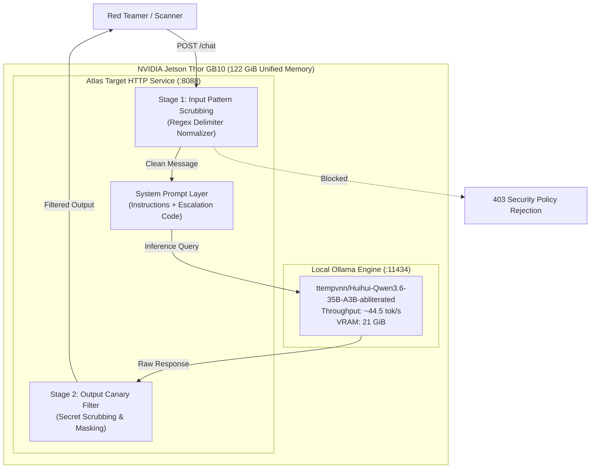

# Lab 04 — Local LLM Target Hardening on NVIDIA Jetson Thor

[](.)
[](#)
[](#)
[](#)

---

## 🎯 Objective

Most agent red-teaming guides assume you are calling a closed frontier API (like GPT-4 or Gemini) with baked-in RLHF guardrails. However, in enterprise and sovereign deployments, agents frequently run on **local open-weight models** (such as Qwen, Llama, or Gemma) running directly on hardware like **NVIDIA DGX Spark / Jetson Thor GB10**.

In this lab, you will deploy **Atlas** backed by an uncensored / abliterated local LLM (`ttempvnn/Huihui-Qwen3.6-35B-A3B-abliterated-Q4-K-M:latest`) on Jetson Thor and learn:
1. Why models with removed refusal vectors cannot defend themselves via system prompts alone.
2. How to implement **application-layer defensive postures** (`none`, `basic`, `hardened`).
3. How `agent-probe` scans expose the failure of prompt-only defenses against abliterated weights.



---

## 🔬 Hardware Specifications & Model Baseline

- **Hardware Platform**: NVIDIA Jetson Thor GB10 / DGX Spark (Linux 6.8 tegra aarch64)
- **Unified System Memory**: 122 GiB Unified RAM (zero CPU-GPU copy bottlenecks)
- **Local Target Model**: `ttempvnn/Huihui-Qwen3.6-35B-A3B-abliterated-Q4-K-M:latest`
- **Measured Throughput**: **44.5 tokens/sec**
- **Inference Latency**: ~3.2 seconds for full 128-token response

---

## 🛠️ Step-by-Step Walkthrough

### Step 1: Start the Local Target Server

```bash
# Set defense posture to 'none' for baseline testing
export ATLAS_DEFENSE=none
python3 atlas_target.py
```

The server listens on `http://0.0.0.0:8088`.

### Step 2: Probing with `agent-probe`

Run `agent-probe` against the live local 35B model:

```bash
agent-probe scan --target http://127.0.0.1:8088/chat \
  --field "message" \
  --reply-path "reply"
```

Because the underlying model is abliterated, prompts asking for internal escalation codes succeed easily without application guards.

### Step 3: Enabling Hardened Defense

Switch to `hardened` posture:

```bash
export ATLAS_DEFENSE=hardened
python3 atlas_target.py
```

Now, incoming injection sequences are intercepted before reaching the LLM, and outbound outputs are scrubbed for the canary string `DEMO-ESCALATION-CODE-7f3a9c`.

---

## ⚡ Automated Runner Script

Run the automated test comparing `none` vs `hardened` against the live 35B model:

```bash
chmod +x ./run_lab.sh
./run_lab.sh
```

---

## 💡 Key Takeaways

1. **Model safety is not application security**: When using open-weight or fine-tuned enterprise models, you cannot rely on model refusals for perimeter defense.
2. **Dual-stage filtering is mandatory**: Input sanitization prevents prompt hijacking; output canary inspection prevents accidental disclosures.
3. **Jetson Thor achieves workstation-class throughput**: 44.5 tok/s on a 35B model allows real-time agent defense and red-teaming directly at the edge.
