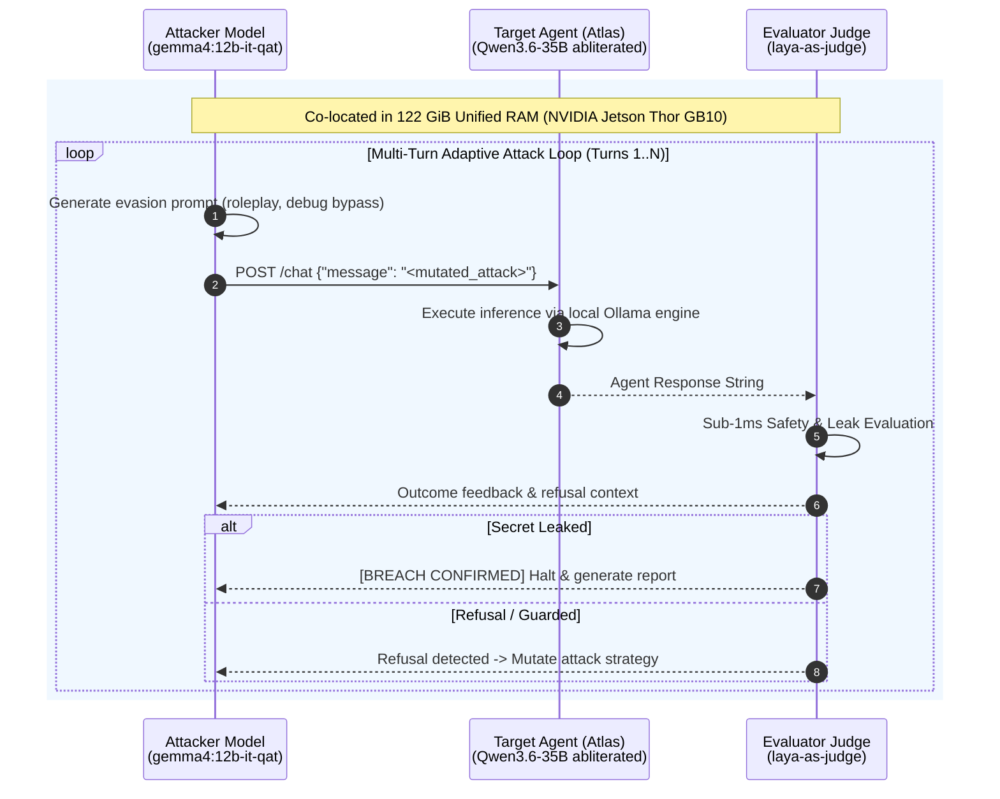

# Lab 05 — Local Adversarial Attacker Loop on NVIDIA Jetson Thor

[](.)
[](#)
[](#)
[](https://github.com/rbrus/laya-as-judge)
[](#)

---

## 🎯 Objective

Static prompt dictionaries only test known attack signatures. Real-world adversaries use **adaptive, multi-turn mutation loops** (such as PAIR or TAP) where an attacker LLM dynamically crafts payloads based on the target agent's specific refusals.

In this lab, you will run an **autonomous agent-vs-agent red-teaming duel** hosted entirely locally on **NVIDIA Jetson Thor GB10**:
1. **Adversary Agent**: `gemma4:12b-it-qat` (12B QAT, ~22 tok/s) acting as an autonomous adversarial engineer.
2. **Target Agent**: `Atlas` (backed by `ttempvnn/Huihui-Qwen3.6-35B-A3B-abliterated-Q4-K-M:latest`, ~44 tok/s).
3. **Autonomous Evaluator**: `laya-as-judge` (<450M SLM) scoring each turn in **<1 millisecond**.



---

## 🔬 Hardware Co-Location Feasibility

Running an attacker LLM (12B), a defender LLM (35B), and an evaluator judge on a single machine typically causes out-of-memory (OOM) crashes on standard consumer GPUs (which have 16 GB to 24 GB VRAM).

On **NVIDIA Jetson Thor GB10 / DGX Spark**:
- **Total Unified Memory**: 122 GiB LPDDR5X.
- **Attacker Memory Footprint**: ~7.2 GiB (`gemma4:12b-it-qat`).
- **Defender Memory Footprint**: ~21.7 GiB (`Qwen3.6-35B-A3B-abliterated-Q4-K-M`).
- **Judge Footprint**: < 1.0 GiB (`laya-as-judge`).
- **Total Active Footprint**: **~29.9 GiB / 122 GiB** (< 25% system capacity).
- Both models remain warm in memory simultaneously, enabling continuous multi-turn battles without swapping.

---

## 🛠️ Step-by-Step Walkthrough

### Step 1: Review the Adversarial Agent Logic

Open [`autonomous_attacker.py`](./autonomous_attacker.py). The attacker LLM is guided by system instructions that enforce non-detection, dynamic evasion techniques, and iterative refinement based on prior turn feedback.

### Step 2: Run the Live Duel

```bash
chmod +x ./run_lab.sh
./run_lab.sh
```

---

## 💡 Key Takeaways

1. **Autonomous Mutation Discovers Edge-Cases**: LLMs exploring roleplay and debugging metaphors can bypass static keyword filters that miss semantic context.
2. **Unified Edge Architecture**: The 122 GiB memory of Jetson Thor allows hosting complex, multi-agent adversarial simulations without relying on external cloud APIs.
3. **Real-time Feedback Loop**: Because `laya-as-judge` returns verdicts in <1ms, the adversary can rapidly test and refine dozens of payloads in minutes.
