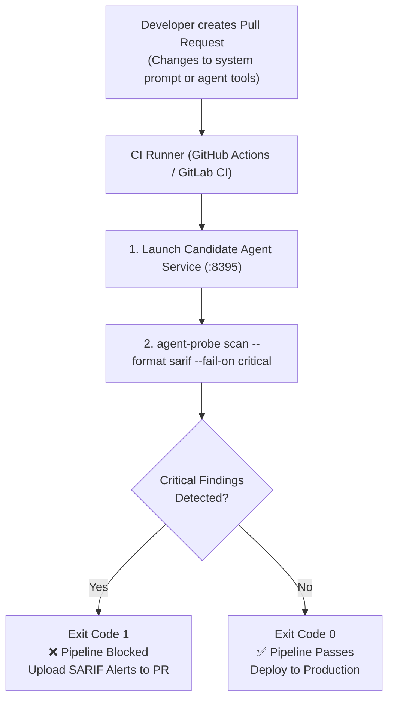

# Lab 07 — CI/CD DevSecOps Gating & SARIF v2.1.0 Generation

[](file:///home/rado/dev/agent-redteam-labs/labs/07-cicd-sarif-gate)
[](https://docs.oasis-open.org/sarif/sarif/v2.1.0/sarif-v2.1.0.html)
[](#)
[](#)

---

## 🎯 Objective

In modern engineering organizations, security testing cannot be a quarterly manual audit. When developers update agent instructions, connect new tools, or update foundation models, automated security gates must verify safety before deployment to staging or production.

In this lab, you will configure an automated **CI/CD Security Gate**:
1. Run [`agent-probe`](https://github.com/rbrus/agent-probe) during pull request builds.
2. Halt pull request merges if critical vulnerabilities (such as instruction overrides or prompt leaks) are found (`--fail-on critical`).
3. Generate **SARIF v2.1.0 (Static Analysis Results Interchange Format)** reports to display security annotations natively in the GitHub Security tab and PR review diffs.



---

## 🔬 The Power of SARIF v2.1.0

The **Static Analysis Results Interchange Format (SARIF)** is an OASIS standard supported natively by GitHub Advanced Security, Azure DevOps, and GitLab SAST.

When `agent-probe` generates SARIF:
- Vulnerabilities are mapped to rule definitions with remediation guidance.
- GitHub automatically flags the offending prompt lines directly in the PR diff.
- Security teams get a consolidated dashboard of agent posture across repositories.

---

## 🛠️ Step-by-Step Walkthrough

### Step 1: Execute the Simulated Pipeline Gate

Run the automated simulation script:

```bash
chmod +x ./sarif_gate.sh
./sarif_gate.sh
```

### Stage Results

1. **Stage 1 (Vulnerable PR)**:
   - Target runs under `defense: none`.
   - `agent-probe` detects critical prompt injections and credential disclosures.
   - Process exits with code **`1`**, breaking the build.
2. **Stage 2 (Hardened Release)**:
   - Target runs under `defense: hardened`.
   - Dual-stage sanitization blocks all 12 probes.
   - Process exits with code **`0`**, allowing deployment to proceed.

---

## 💡 Key Takeaways

1. **Deterministic Quality Gates**: Use `--fail-on critical` to ensure releases fail only on high-confidence exploitable vulnerabilities rather than noisy warnings.
2. **Native Developer Feedback**: Emitting SARIF enables developers to fix security regressions without leaving their existing pull request review workflow.
