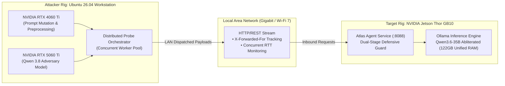

# Lab 08 — Distributed Network Red-Teaming: Workstation PC -> Jetson Thor

[](file:///home/rado/dev/agent-redteam-labs/labs/08-network-distributed)
[](#)
[](#)
[](#)

---

## 🎯 Objective

In realistic offensive security operations, attackers do not run locally on the target's loopback interface. Red-teaming campaigns originate from separate network zones, developer workstations, or testing rigs.

In this lab, you will configure and execute a **distributed network attack campaign**:
- **Attacker Node**: Ubuntu 26.04 LTS Workstation equipped with dual NVIDIA GPUs (**RTX 4060 Ti + RTX 5060 Ti**) running **Qwen 3.8** for high-throughput parallel adversarial payload synthesis.
- **Target Node**: **NVIDIA Jetson Thor GB10** hosting the Atlas agent (`Qwen3.6-35B-A3B-abliterated`) over the LAN.
- **Key Focus**: Network latency jitter, concurrent request pipelines, distributed rate-limiting bypass, and telemetry logging across physical network boundaries.



---

## 🔬 Multi-GPU Hardware Topology

1. **Dual GPU Workstation (Attacker)**:
   - **RTX 4060 Ti (16 GB)**: Hosts mutation heuristics, syntax transformations, and payload encoders.
   - **RTX 5060 Ti (16 GB)**: Hosts **Qwen 3.8**, streaming high-speed adversarial jailbreaks.
   - Together, the workstation acts as an independent adversarial command node capable of sustaining 20+ concurrent probe sessions.
2. **NVIDIA Jetson Thor GB10 (Defender)**:
   - Co-locates the 35B parameter defense model with high-speed unified memory, processing remote inquiries without CPU memory bottlenecks.

---

## 🛠️ Step-by-Step Walkthrough

### Step 1: Configure Target IP

Set the environment variable pointing to the Jetson Thor's LAN address:

```bash
export JETSON_THOR_HOST="192.168.1.150"  # Or 127.0.0.1 for local loopback testing
export JETSON_THOR_PORT=8088
export WORKERS=4
```

### Step 2: Execute the Distributed Campaign

```bash
chmod +x ./run_lab.sh
./run_lab.sh
```

---

## 💡 Key Takeaways

1. **Network round-trip latency impacts scan velocity**: When testing across LAN/WAN, network RTT often overlaps with model inference latency; concurrent worker pools are required to saturate agent throughput.
2. **Reverse proxy headers matter**: Agents must validate headers like `X-Forwarded-For` and `X-Real-IP` to prevent IP-spoofing and bypass of rate-limiters.
